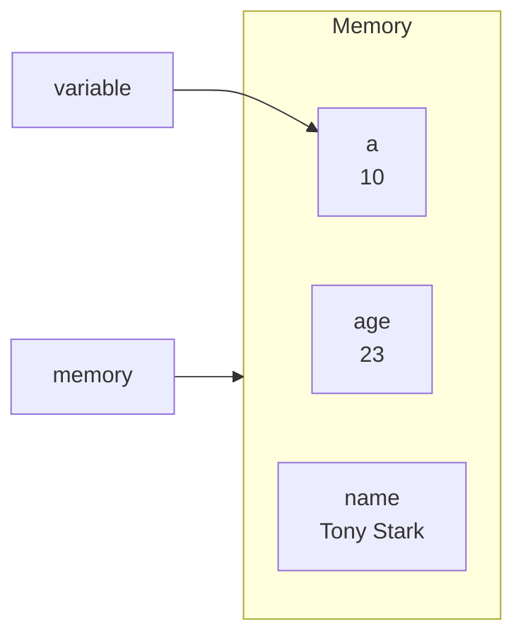

A variable is just the name of a storage location. 
In code, the container used to store the data or information is the variable.



## Data Types in JS
### Primitive Types

| Type          | Description                         | `typeof`    | Example                         |
| ------------- | ----------------------------------- | ----------- | ------------------------------- |
| **String**    | Text data                           | `string`    | `"hello"`, `''`, `` `hi` ``     |
| **Number**    | Numeric values (ints & floats)      | `number`    | `42`, `3.14`, `NaN`, `Infinity` |
| **BigInt**    | Arbitrary‑precision integers        | `bigint`    | `123n`, `9007199254740991n`     |
| **Boolean**   | Logical true/false                  | `boolean`   | `true`, `false`                 |
| **Undefined** | Uninitialized variable              | `undefined` | `let x; console.log(x);`        |
| **Null**      | Intentional “no value” placeholder  | `object` *  | `null`                          |
| **Symbol**    | Unique identifiers (often for keys) | `symbol`    | `Symbol('id')`                  |

> *Note: `typeof null` returns `"object"` (historical JavaScript quirk).*

---

### Non‑Primitive (Object) Types

| Type          | Description                               | `typeof`                          | Example                           |
| ------------- | ----------------------------------------- | --------------------------------- | --------------------------------- |
| **Object**    | General key/value collections             | `object`                          | `{ name: 'Tony' }`                |
| **Array**     | Indexed lists (special kind of object)    | `object`                          | `[1, 2, 3]`                       |
| **Function**  | Callable blocks of code                   | `function`                        | `function foo() {}` or `() => {}` |
| **Date**      | Date/time values                          | `object`                          | `new Date()`                      |
| **RegExp**    | Regular expressions                       | `object`                          | `/ab+c/i`                         |
| **…and more** | Map, Set, WeakMap, WeakSet, Promise, etc. | `object` (or `function` for some) | `new Map()`, `Promise.resolve()`  |
In JavaScript, we don't need to explicitly mention the type of a variable. It automatically detects its type (unlike C++/C/JAVA)

## Operations in JS
### Arithmetic Operators

| Operator     | Description                | Example        |
| ------------ | -------------------------- | -------------- |
| `+`          | Addition                   | `2 + 3  // 5`  |
| `-`          | Subtraction                | `5 - 2  // 3`  |
| `*`          | Multiplication             | `4 * 3  // 12` |
| `/`          | Division                   | `8 / 2  // 4`  |
| `%` (modulo) | Remainder                  | `7 % 3  // 1`  |
| `**`         | Exponentiation             | `2 ** 3 // 8`  |
| `++`         | Increment (prefix/postfix) | `i++`, `++i`   |
| `--`         | Decrement (prefix/postfix) | `i--`, `--i`   |

---

#### Operator Precedence - PEMDAS
From highest to lowest:
1. **Grouping** `( )`  
2. **Exponentiation** `**`  
3. **Multiplication / Division / Remainder** `*`, `/`, `%`  
4. **Addition / Subtraction** `+`, `-`  

| Precedence | Operator                                                                                  | Description                            | Associativity |
| ---------- | ----------------------------------------------------------------------------------------- | -------------------------------------- | ------------- |
| 1          | `()`                                                                                      | Grouping                               | —             |
| 2          | `new A()`                                                                                 | `new` with arguments                   | —             |
| 3          | `new A`                                                                                   | `new` without arguments                | Right-to-left |
| 4          | `[]` `.`                                                                                  | Member access / Computed member access | Left-to-right |
| 5          | `() `                                                                                     | Function call                          | Left-to-right |
| 6          | `++` `--` (postfix)                                                                       | Post‑increment / Post‑decrement        | Left-to-right |
| 7          | `!` `~` `+` `-` `++` `--` `typeof` `void` `delete` `await`                                | Unary operators                        | Right-to-left |
| 8          | `**`                                                                                      | Exponentiation                         | Right-to-left |
| 9          | `*` `/` `%`                                                                               | Multiplication, Division, Remainder    | Left-to-right |
| 10         | `+` `-`                                                                                   | Addition, Subtraction                  | Left-to-right |
| 11         | `<<` `>>` `>>>`                                                                           | Bitwise shifts                         | Left-to-right |
| 12         | `<` `<=` `>` `>=` `in` `instanceof`                                                       | Relational / Membership / Type check   | Left-to-right |
| 13         | `==` `!=` `===` `!==`                                                                     | Equality / Strict equality             | Left-to-right |
| 14         | `&`                                                                                       | Bitwise AND                            | Left-to-right |
| 15         | `^`                                                                                       | Bitwise XOR                            | Left-to-right |
| 16         | `\|`                                                                                      | Bitwise OR                             | Left-to-right |
| 17         | `&&`                                                                                      | Logical AND                            | Left-to-right |
| 18         | `\|\|`                                                                                    | Logical OR                             | Left-to-right |
| 19         | `??`                                                                                      | Nullish coalescing                     | Left-to-right |
| 20         | `?:`                                                                                      | Conditional (ternary)                  | Right-to-left |
| 21         | `=` `+=` `-=` `*=` `/=` `%=` `**=` `<<=` `>>=` `>>>=` `&=` `^=` `\|=` `&&=` `\|\|=` `??=` | Assignment / Compound assignment       | Right-to-left |
| 22         | `,`                                                                                       | Comma                                  | Left-to-right |

### Assignment Operators

| Operator | Description                   | Example                 |                       |     |     |      |
| -------- | ----------------------------- | ----------------------- | --------------------- | --- | --- | ---- |
| `=`      | Simple assignment             | `x = 5`                 |                       |     |     |      |
| `+=`     | Add and assign                | `x += 2  // x = x + 2`  |                       |     |     |      |
| `-=`     | Subtract and assign           | `x -= 1  // x = x - 1`  |                       |     |     |      |
| `*=`     | Multiply and assign           | `x *= 3  // x = x * 3`  |                       |     |     |      |
| `/=`     | Divide and assign             | `x /= 2  // x = x / 2`  |                       |     |     |      |
| `%=`     | Remainder and assign          | `x %= 4  // x = x % 4`  |                       |     |     |      |
| `**=`    | Exponentiate and assign       | `x **= 2 // x = x ** 2` |                       |     |     |      |
| `&&=`    | Logical AND and assign        | `x &&= y`               |                       |     |     |      |
| `        |                               | =`                      | Logical OR and assign | `x  |     | = y` |
| `??=`    | Nullish coalescing and assign | `x ??= y`               |                       |     |     |      |

---

### Unary Operators
## Pre‑ and Post‑Increment / Decrement in JavaScript

| Operator | Description                                   | Example                    | Expression Value | Final Variable Values |
| -------- | --------------------------------------------- | -------------------------- | ---------------- | --------------------- |
| `++x`    | **Pre‑increment**: increment **then** return  | `let x = 1;\nlet y = ++x;` | `2`              | `x === 2`, `y === 2`  |
| `x++`    | **Post‑increment**: return **then** increment | `let x = 1;\nlet y = x++;` | `1`              | `x === 2`, `y === 1`  |
| `--x`    | **Pre‑decrement**: decrement **then** return  | `let x = 1;\nlet y = --x;` | `0`              | `x === 0`, `y === 0`  |
| `x--`    | **Post‑decrement**: return **then** decrement | `let x = 1;\nlet y = x--;` | `1`              | `x === 0`, `y === 1`  |
### Comparison Operators

| Operator | Description                     | Example               |
| -------- | ------------------------------- | --------------------- |
| `==`     | Equal (type‑coerced)            | `5 == '5'   // true`  |
| `!=`     | Not equal (type‑coerced)        | `5 != '4'   // true`  |
| `===`    | Strict equal (no type coercion) | `5 === '5'  // false` |
| `!==`    | Strict not equal                | `5 !== '5'  // true`  |
| `>`      | Greater than                    | `7 > 3      // true`  |
| `>=`     | Greater than or equal           | `7 >= 7     // true`  |
| `<`      | Less than                       | `2 < 5      // true`  |
| `<=`     | Less than or equal              | `2 <= 2     // true`  |

---

### Logical Operators

| Operator | Description                           | Example                     |
|----------|---------------------------------------|-----------------------------|
| `&&`     | Logical AND                           | `a && b      // b if a truthy`    |
| `||`     | Logical OR                            | `a || b      // a if truthy`     |
| `!`      | Logical NOT                          | `!true      // false`        |
| `??`     | Nullish coalescing (`null`/`undefined`) | `null ?? 'default' // 'default'` |

---

### Bitwise Operators

| Operator | Description                    | Example           |
|----------|--------------------------------|-------------------|
| `&`      | Bitwise AND                    | `5 & 3   // 1`    |
| `\|`     | Bitwise OR                     | `5 \| 3  // 7`    |
| `^`      | Bitwise XOR                    | `5 ^ 3   // 6`    |
| `~`      | Bitwise NOT                    | `~5      // -6`   |
| `<<`     | Left shift                     | `2 << 1  // 4`    |
| `>>`     | Sign-propagating right shift   | `5 >> 1  // 2`    |
| `>>>`    | Zero-fill right shift          | `5 >>> 1 // 2`    |

---

### String Operator

| Operator | Description                   | Example                      |
|----------|-------------------------------|------------------------------|
| `+`      | Concatenation                 | `'Hi, ' + 'Tony'  // 'Hi, Tony'` |

---

### Conditional (Ternary) Operator

| Operator    | Description                       | Example                                      |
|-------------|-----------------------------------|----------------------------------------------|
| `? :`       | `condition ? exprIfTrue : exprIfFalse` | `age >= 18 ? 'adult' : 'minor'` |

---

### Type & Other Operators

| Operator       | Description                                                 | Example                              |
|----------------|-------------------------------------------------------------|--------------------------------------|
| `typeof`       | Returns the type of its operand                            | `typeof 123      // 'number'`        |
| `instanceof`   | Tests prototype chain                                       | `obj instanceof Object  // true`     |
| `in`           | Checks for property in object                                | `'name' in person  // true`          |
| `delete`       | Removes a property from an object                           | `delete obj.age`                     |
| `void`         | Evaluates expression and returns `undefined`                | `void 0   // undefined`              |
| `?.` (optional chaining) | Safely access nested properties                   | `user?.address?.city`                |
| `...` (spread/rest)       | Expands or collects elements/props               | `[..., arr2]`, `function(...args){}` |

---
### NaN in JS
**NaN** stands for **“Not‑a‑Number”**. It’s a special value in JavaScript’s **Number** type that represents an invalid or unrepresentable numerical result.

### let, const and var keyword in JS
```js
{
  // console.log(y); // ReferenceError: Cannot access 'y' before initialization
  let y = 5;
  // let y = 6;     // SyntaxError: Identifier 'y' has already been declared
  y = 7;            // reassignment OK
  console.log(y);   // → 7
}
```

> var is the old syntax used before 'let' was introduced.

```js
const PI = 3.14;
// PI = 3;        // TypeError: Assignment to constant variable
// const PI = 3;  // SyntaxError: Identifier 'PI' has already been declared

const obj = { a: 1 };
obj.a = 2;        // ✅ mutating contents is allowed
console.log(obj); // → { a: 2 }

// obj = {};     // ❌ TypeError: Assignment to constant variable
```

### JavaScript Identifier Rules (Rules for naming variables)

An **identifier** is the name you give to variables, functions, classes, etc. In JavaScript, identifiers must follow these rules:

1. **First Character**  
   - Must be a letter (A–Z or a–z), underscore (`_`), or dollar sign (`$`).  
   - **Cannot** start with a digit (0–9).

2. **Subsequent Characters**  
   - May include letters, digits, underscores, or dollar signs.  
   - In full Unicode mode, you may also use Unicode letters (e.g. `Ω`, `你好`), combining marks, and connector punctuation.

3. **Case‑Sensitivity**  
   - Identifiers are case‑sensitive: `myVar`, `MyVar`, and `myvar` are three different names.

4. **No Reserved Words**  
   - You **cannot** use JavaScript keywords or future reserved words as identifiers, e.g.:  
     `var`, `let`, `const`, `function`, `class`, `if`, `for`, `while`, `import`, `export`, etc.

5. **Length**  
   - There is no practical length limit, but extremely long names hurt readability.

---

### Valid Examples

```js
let myVar       = 10;
const _count    = 42;
var $element    = document.getElementById('app');
function Ωmega() { /* … */ }
```

> `camelCase` is the default JavaScript naming convention (also the case in c++, unlike python where we use `snake_case`)

### Boolean in JavaScript

The **Boolean** type represents logical truth values.

- **Values:**  
  - `true`  
  - `false`  

- **Type Check:**  
  ```js
  typeof true  // "boolean"
  typeof false // "boolean"
```

> Type of a variable can be changed in JavaScript (unlike C++ and JAVA).


## JavaScript vs TypeScript
## JavaScript vs. TypeScript

| Aspect                     | JavaScript                                                            | TypeScript                                                                              |
| -------------------------- | --------------------------------------------------------------------- | --------------------------------------------------------------------------------------- |
| **Definition**             | A dynamic, interpreted scripting language                             | A superset of JavaScript that adds static typing                                        |
| **Typing**                 | **Dynamic / weak** — types are checked at runtime; implicit coercions | **Static / strong** — you declare types; checked at compile time                        |
| **Compilation**            | Executed directly by the JS engine in browsers or Node.js             | Must be **transpiled** (via `tsc` or Babel) to plain JS before execution                |
| **Error Detection**        | Errors often surface only at runtime                                  | Many errors (type mismatches, missing properties) caught at compile time                |
| **Tooling & IDE**          | Good support (linting, formatting)                                    | Excellent support (autocomplete, refactoring, jump‑to‑definition) thanks to type system |
| **Learning Curve**         | Lower — fewer concepts to learn                                       | Higher — need to understand generics, interfaces, advanced types                        |
| **Backward Compatibility** | Runs in any JS environment                                            | Generates JS compatible with target environments; you can adopt gradually               |
| **Ecosystem**              | Huge package ecosystem on npm                                         | Fully interoperable with JS libraries; may need type definitions (`@types/...`)         |
| **Use Cases**              | Quick scripts, small projects, dynamic apps                           | Large codebases, collaborative teams, libraries, frameworks                             |
| **Code Example**           | ```js                                                                 | ```ts                                                                                   |
|                            | function greet(name) {                                                | function greet(name: string): string {                                                  |
|                            | return "Hello, " + name + "!";                                        | return `Hello, ${name}!`;                                                               |
|                            | }                                                                     | }                                                                                       |
|                            | ```                                                                   | ```                                                                                     |
|                            |                                                                       |                                                                                         |

### When to Use What

- **JavaScript**  
  - Prototyping, small scripts, or when you need to ship quickly without a build step.  
  - Learning the fundamentals of web development.

- **TypeScript**  
  - Large, shared codebases where maintainability and early error detection matter.  
  - Projects that benefit from clear API contracts and enhanced IDE support.  

### JavaScript Example

```js
// No compile‑time type checking
function add(a, b) {
  return a + b;
}

console.log(add(5, 2));     // 7
console.log(add(5, "2"));   // "52"  ← oops, concatenation at runtime
```

```ts
// Static types declared
function add(a: number, b: number): number {
  return a + b;
}

console.log(add(5, 2));     // 7
console.log(add(5, "2"));   // ✖ Compile‑time error!
                             //   Argument of type '"2"' is not assignable to parameter of type 'number'.
```

## String Indexing

JavaScript strings behave like arrays of UTF‑16 code units. You can read individual characters using bracket notation or `.charAt()`:

```js
const str = "Hello, world!";

console.log(str[0]);       // "H"
console.log(str[1]);       // "e"
console.log(str[7]);       // "w"
console.log(str[100]);     // undefined (out of range)

console.log(str.charAt(0)); // "H"
console.log(str.charAt(7)); // "w"
```

## String concatenation
```js
const a = "Hello";
const b = "World";
const c = a + ", " + b + "!";  
console.log(c); // "Hello, World!"

// using '+'
let greeting = "Hello";
greeting += ", ";
greeting += "everyone";
greeting += "!";
console.log(greeting); // "Hello, everyone!"
```

## Null and Undefined
### undefined
- **What it is:** A primitive value automatically assigned to variables that have been declared but not initialized, to function parameters that are not provided, or returned by functions with no explicit `return`.  
- **Type:**  
  ```js
  typeof undefined  // "undefined"
```

### null
- **What it is:** A primitive literal you assign intentionally to signal “no value” or “empty.”
- **Type quirk:**
```js
let user = null;       // user not set yet
obj.prop = null;       // explicit “no value” for this property
```

